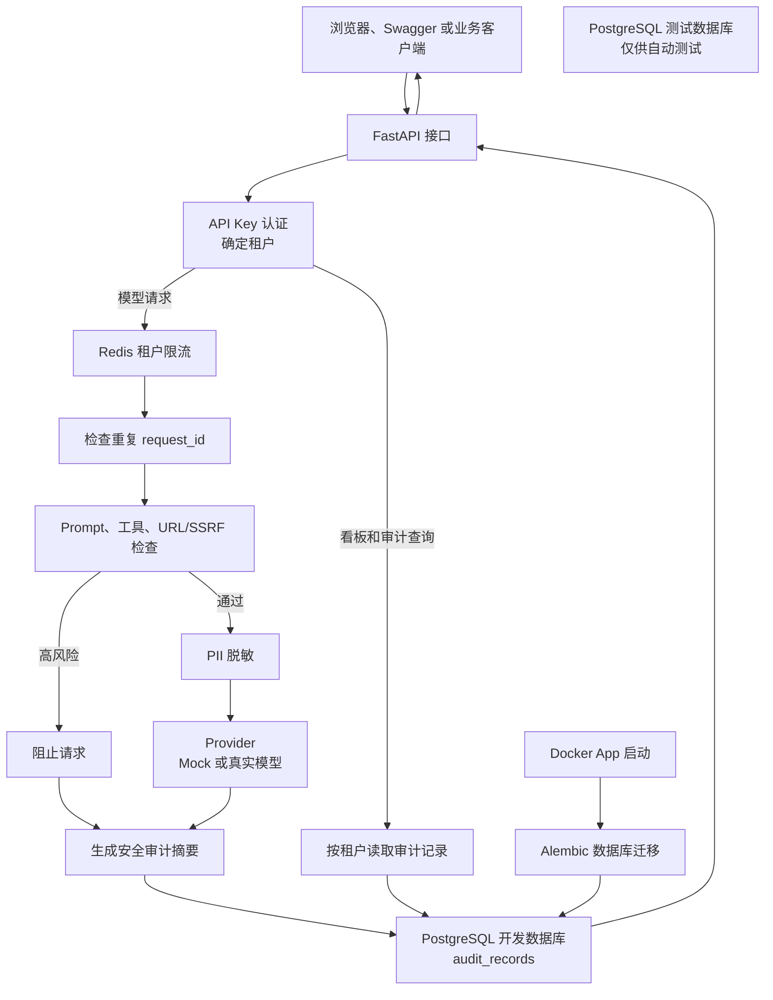

# AgentShield 当前架构与设计取舍

本文描述 `v1.0-month` 当前已实现的本地演示架构，不代表完整企业安全方案。

## 架构图

## 一次模型请求如何流转

1. 客户端在 `X-API-Key` 请求头中携带 AgentShield API Key。
2. FastAPI 验证 Key，并从 Key 的配置中确定 `tenant_id`（租户编号）；不会相信请求体自行提交的租户编号。
3. `/model/test` 与 `/model/call` 先由 Redis 按租户限流（限制单位时间内允许通过的请求数量）。Redis 不可用时采用 fail-closed（无法安全确认是否超限时拒绝请求）。
4. 系统检查 `request_id` 是否重复，再按顺序执行 Prompt Injection（通过恶意提示词诱导模型忽略安全规则）、工具允许名单和 URL/SSRF（诱使服务器访问不该访问的内网或本机地址）检查。
5. 高风险请求被阻止，不调用模型；通过前面检查的请求再执行 PII（可以识别个人身份的敏感信息）脱敏。
6. Provider（模型服务适配层，把不同模型调用方式统一起来）调用 Mock 或本机配置的真实模型服务。
7. 系统写入 PostgreSQL 审计记录：只保留状态、风险类型、处理动作、耗时和安全摘要，不保留完整 Prompt、完整回答或 API Key。

## 主要组件

| 组件 | 当前职责 | 数据边界 |
|---|---|---|
| FastAPI | 提供模型、审计、看板和健康检查接口 | 响应不返回完整 API Key 或完整 Prompt |
| API Key 认证 | 验证 Key，确定租户 | 请求体中的 `tenant_id` 不作为认证依据 |
| Redis | 对模型请求按认证租户计数 | Redis 故障时拒绝模型请求 |
| 安全检查 | 阻止明显 Prompt Injection、未允许工具和危险 URL；脱敏邮箱与中国大陆手机号 | 规则可解释，但存在误报和漏报 |
| Provider | `/model/test` 固定使用 Mock；`/model/call` 按配置选择 Mock 或真实服务 | 日常自动测试不访问真实模型 |
| PostgreSQL | 保存审计记录；开发库和测试库分离 | 查询必须按认证后的租户过滤 |
| Alembic | 在 Docker App 启动前升级数据库结构 | 迁移记录数据库表结构版本 |
| 本地网页看板 | 显示当前租户的统计和最近 10 条记录 | API Key 仅在当前页面内存中使用 |

## 设计取舍

### 认证结果决定租户

选择：由已验证 API Key 对应的租户决定数据范围。

原因：请求体的字段可以被伪造。审计查询和看板汇总都使用认证结果过滤，避免一个租户读取另一个租户的记录。

当前限制：Key 仍是本机静态配置，尚未实现哈希保存、自动轮换或复杂角色权限。

### Redis 故障时拒绝模型请求

选择：限流服务无法使用时返回 `503`，不继续调用模型。

原因：继续放行会失去费用和滥用控制；对于安全网关，拒绝不确定请求比静默放行更符合当前目标。

当前限制：可用性降低；当前使用固定时间窗口，窗口边界可能出现短时间突发。

### 安全检查采用短路顺序

选择：按 Prompt、工具、URL/SSRF、PII 的顺序处理；高风险命中后立即停止。

原因：阻止请求不应再调用模型或工具，且一条审计记录只需清楚说明第一个阻止原因。

当前限制：同一请求中的后续风险不会被列出；简单规则不能替代完整安全策略。

### 审计记录只保存安全摘要

选择：保存状态、风险和处理动作，而非完整 Prompt、完整回答或密钥。

原因：审计日志（记录谁在什么时候做了什么，方便追查）本身也可能成为敏感信息泄露位置。

当前限制：无法仅依靠审计记录复原完整对话；需要更细粒度追查时，应采用额外授权和安全存储设计。

### Mock 与真实模型分开

选择：日常演示、自动测试和压力测试默认使用 Mock；真实调用只通过 `/model/call` 进行人工验证。

原因：保证自动测试可重复，不意外联网或消耗模型费用。

当前限制：目前只人工验证过一家第三方 OpenAI 兼容服务，不能说明所有模型服务均已验证。

## 部署范围

当前已经验证的是本机 Docker Compose：FastAPI、Redis、开发 PostgreSQL 与测试 PostgreSQL 一起启动，App 启动前执行 `alembic upgrade head`。这适合本地演示与学习，不等同于公网部署、监控、备份或高可用方案。

完整启动和停止方法见 `README.md`；三分钟演示步骤见 `docs/demo-guide.md`。
